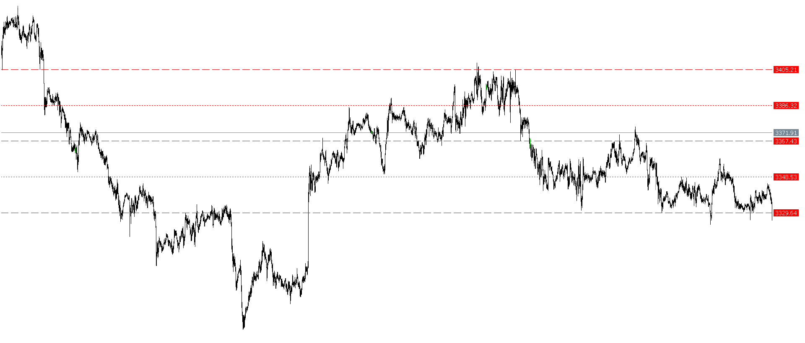

# Weekly Map Indicator

This indicator is designed to **plot weekly levels** on the chart. After each trading week ends, the indicator refreshes and draws the key levels from the previous week.  

The goal is to provide traders with clear visual references for support/resistance levels based on weekly price action.

---

## Features

- **Automatic refresh at the end of each week**.  
- **Plots weekly levels** (lines) from the previous week.  
- **Fully customizable appearance**:
  - Line color  
  - Line thickness  
  - Line style  

- Includes both **source code** and **compiled file** (`.ex5`) for quick installation.

---

## How to Use

1. Copy the compiled file (`WeeklyMap.ex5`) to your MetaTrader 5 `Indicators` folder:
2. Restart MetaTrader 5 or refresh the Navigator.  
3. Attach the indicator to your desired chart.  
4. Adjust settings (color, width, style) as needed in the indicator's input parameters.

---

## Input Parameters

- **LineColor** – Color of weekly lines  
- **LineWidth** – Thickness of the lines  
- **LineStyle** – Style (solid, dashed, dotted, etc.)  

---

## Notes

- This indicator is designed for **MetaTrader 5**.  
- The lines will be updated at the close of each weekly candle.

---

##Disclaimer

**Use the lines as visual guides; do not rely solely on them for trading decisions**

---

## License

This project is open for personal and educational use. You are free to modify and share it.
